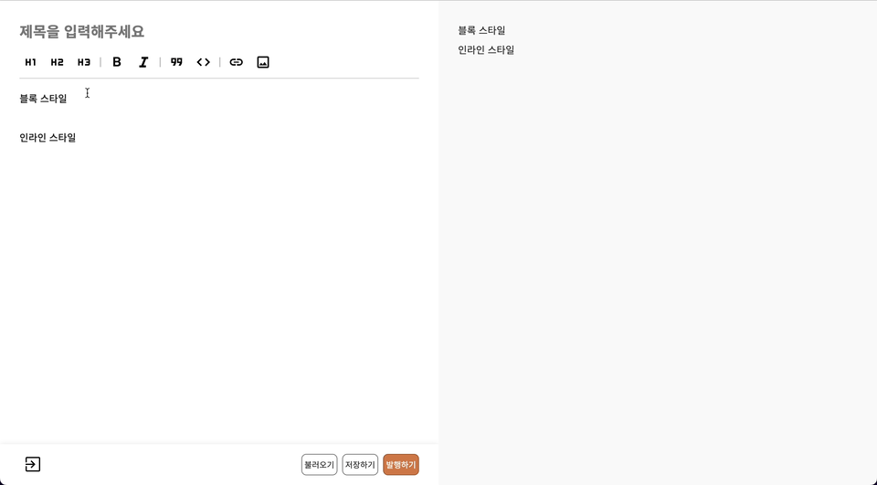

## 글의 가치를 올려주는 에디터

[Knoticle](https://github.com/boostcampwm-2022/web01-knoticle) 서비스에서 글은 큰 비중을 차지하고 있습니다. 사용자들이 좋은 글을 엮고, 엮은 글들을 재공유하면서 서비스를 풍부하게 발전시킵니다.

사용자들이 글을 엮기에 앞서 좋은 글들이 공유되기 위해선 글을 작성할 수 있는 환경이 필요합니다. 여기서 더 나아가 단순히 텍스트만 나열하는 것이 아니라 이미지를 첨부하고, 각종 스타일을 넣을 수 있는 환경까지 갖춰진다면 글이라는 핵심 요소의 가치가 더욱 부각될 것 입니다.


이번 글에서는 위와 같은 마크다운 에디터를 개발한 과정을 소개하고자 합니다.

## CodeMirror 에디터 활용하기

> 코드미러(CodeMirror)는 브라우저에 코드 편집기를 제공하는 자바스크립트 구성 요소이다. 풍부한 프로그래밍 API를 보유하고 있으며 확장성에 초점을 둔다.

코드미러는 확장(extension)의 추가로 여러가지 기능을 손쉽게 추가할 수 있는 코드 편집 라이브러리입니다. 에디터를 만들면서 코드미러의 몇 가지 기능을 활용했습니다.

- 마크다운 구문 강조(syntax highlighting)
- 에디터 커스텀 테마
- 단축키 맵핑
- 커서 위치 정보

이러한 코드미러를 재사용 할 수 있도록 훅으로 만들었고, 이는 글쓰기 페이지 뿐만 아니라 추후에 추가될 댓글 기능에서도 활용할 수 있습니다.

```tsx
// useCodeMirror.ts

import { useCallback, useEffect, useState } from 'react';

import { markdown, markdownLanguage } from '@codemirror/lang-markdown';
import { languages } from '@codemirror/language-data';
import { EditorState } from '@codemirror/state';
import { EditorView } from 'codemirror';

export default function useCodeMirror() {
  const [element, setElement] = useState<HTMLElement>();

  const ref = useCallback((node: HTMLElement | null) => {
    if (!node) return;

    setElement(node);
  }, []);

  useEffect(() => {
    if (!element) return;

    const editorState = EditorState.create({
      extensions: [
        markdown({
          base: markdownLanguage,
          codeLanguages: languages,
        }),
      ],
    });

    const view = new EditorView({
      state: editorState,
      parent: element,
    });

    return () => view?.destroy();
  }, [element]);

  return {
    ref,
  };
}
```

이제 여기에 여러 가지 기능을 추가하면서 저희들만의 에디터로 가꿔나갈 수 있습니다.

## 이미지 첨부하기

글에서 텍스트만큼이나 중요한 것은 바로 이미지입니다. 여러 줄 글로 주저리주저리 나열하는 것보다 이미지 한 장으로 설명하는게 깔끔한 경우가 많습니다.

그렇다면 이러한 이미지를 첨부하는 방법은 어떤 것들을 고려해볼 수 있을까요?

- 파일 시스템에서 이미지를 복사한 후 에디터에 붙여넣어서 첨부하기
- 파일 시스템에서 이미지를 드래그해서 에디터에 첨부하기
- 이미지 첨부 버튼을 클릭해서 파일 시스템에서 선택한 이미지를 첨부하기

저희 서비스에서는 세 가지 방법 모두 제공하기로 했습니다.

**이벤트 감지(붙여넣기, 드롭, 버튼 클릭) → Knoticle API 서버에 이미지 저장 요청 → 반환된 이미지 URL을 에디터에 첨부**

위와 같은 플로우로 이미지가 첨부됩니다.

### 이미지 붙여넣기

우선 코드미러 익스텐션에 추가할 이벤트 핸들러를 작성해줍니다.

```tsx
// useCodeMirror.ts

const eventHandler = () => { ... }

const editorState = EditorState.create({
  extensions: [
    ...,
    eventHandler(),
	]
})
```

코드미러 뷰에서 제공하는 `domEventHandlers`를 활용하면 붙여넣기 이벤트를 손쉽게 처리할 수 있습니다.

에디터에 포커스가 위치한 상태에서 붙여넣기 이벤트가 발생했을 때 `clipboardData`를 가져올 수 있게 되는데 이 데이터가 이미지 파일인지 검사해서 서버에 보내주면 됩니다. 서버에서는 이미지 파일을 `Object Storage`에 저장하고, 저장된 `URL`을 반환해줍니다.

```tsx
// useCodeMirror.ts

const handleImage = (imageFile: File) => {
  if (!/image\/[png,jpg,jpeg,gif]/.test(imageFile.type)) return;

  const formData = new FormData();

  formData.append('image', imageFile);

  createImage(formData); // Knoticle API 서버에 요청
};

const eventHandler = () => {
  return EditorView.domEventHandlers({
    paste(event) {
      if (!event.clipboardData) return;

      const { items } = event.clipboardData;

      for (const item of items) {
        if (!(item.kind === 'file')) return;
        handleImage(item.getAsFile() as File);
      }
    },
  });
};
```

저장된 URL을 반환받았다면 마크다운 이미지 문법인 `` 형식으로 에디터에 추가해주면됩니다. 이때 자연스럽게 동작하기 위해서 붙여넣은 커서의 위치에 추가해줍니다.

```tsx
// useCodeMirror.ts

const insertCursor = (text: string) => {
  if (!editorView) return;

  editorView.focus();

  // 아래와 같이 에디터의 현재 커서 위치를 알아낼 수 있습니다.
  const cursor = editorView.state.selection.main.head;

  editorView.dispatch({
    changes: { from: cursor, to: cursor, insert: text },
    selection: { anchor: cursor + text.length },
  });
};

useEffect(() => {
  if (!editorView) return;

  const markdownImage = (path: string) => ``;
  const text = markdownImage(image?.imagePath);

  insertCursor(text);
}, [image]);
```


### 이미지 드래그 앤 드롭

해당 방법은 이벤트 핸들러만 추가해주면 위에서 작성한 코드들을 그대로 이용할 수 있습니다. 앞서 작성한 코드들은 재사용이 용이하도록 함수마다 하나의 책임만 가지고 있습니다.

다만 이미지를 드롭할 때 마우스 커서에서 가장 가까운 곳에 이미지가 첨부될 수 있도록 에디터 커서의 위치를 조정해줍니다. 코드미러의 `posAtCoords` 메서드를 활용하면 현재 마우스 커서와 가장 가까운 에디터 커서의 위치를 알아낼 수 있습니다.

```tsx
// useCodeMirror.ts

const eventHandler = () => {
  return EditorView.domEventHandlers({
    ...,
    drop(event, view) {
      if (!event.dataTransfer) return;

      const cursorPos = view.posAtCoords({ x: event.clientX, y: event.clientY });

      if (cursorPos) view.dispatch({ selection: { anchor: cursorPos, head: cursorPos } });

      const { files } = event.dataTransfer;

      for (const file of files) handleImage(file);
    },
  });
};
```


### 이미지 첨부 버튼 클릭

해당 방법은 input 태그를 통해 이미지 파일을 받아오는 방식이기 때문에 코드미러 익스텐션을 이용하지 않고, 직접 HTML 태그를 작성해줍니다. 이후에는 앞서 작성한 함수들을 이용하면 됩니다.

```tsx
// Editor/index.tsx

<input
  id="image"
  type="file"
  accept="image/png,image/jpg,image/jpeg,image/gif"
  onChange={(event) => {
    if (event.target.files) handleImage(event.target.files[0]);
  }}
/>
```


## 마크다운 스타일 버튼 추가하기

마크다운에서는 여러가지 문법을 이용해서 텍스트를 풍부하게 꾸며줄 수 있습니다.

- 블록 스타일: h1(#), h2(##), h3(###) 등
- 인라인 스타일: bold(\*\*), italic(\_), quote(`) 등

이런 스타일들은 직접 작성해도 되지만 편의성을 위해서 버튼 클릭만으로 해당 스타일이 적용되도록 제공할 수 있습니다.

이 기능을 제공하기 위해선 현재 에디터 커서의 위치와 커서가 위치한 곳의 문자열을 파싱하는 것이 중요합니다. 이와 관련된 함수를 작성했다면 커스텀 버튼들을 나열하고 각각의 클릭 이벤트 핸들러에 연결만 시켜주면 됩니다.

### 블록 스타일

블록 스타일은 현재 커서가 위치한 라인에 블록 스타일 마크다운 문법이 적용됐는지 확인해야합니다. 라인에 스타일이 적용되어있으면 해제하고, 해제되어 있으면 적용시켜주도록 토글 방식으로 구현해볼 수 있습니다.

코드미러에서 제공하는 `lineAt` 메서드를 활용하면 현재 커서가 위치한 라인의 정보를 얻을 수 있습니다.

```tsx
// useCodeMirror.ts

// symbol -> '# ', '## ', '### ' 등
const insertStartToggle = (symbol: string) => {
  if (!editorView) return;

  editorView.focus();

  const { head } = editorView.state.selection.main;
  const { from, to, text } = editorView.state.doc.lineAt(head);

  const hasExist = text.startsWith(symbol);

  if (!hasExist) {
    editorView.dispatch({
      changes: {
        from,
        to,
        insert: `${symbol}${text}`,
      },
      selection: {
        anchor: from + text.length + symbol.length,
      },
    });

    return;
  }

  editorView.dispatch({
    changes: {
      from,
      to,
      insert: `${text.slice(symbol.length, text.length)}`,
    },
  });
};
```



### 인라인 스타일

인라인 스타일은 현재 에디터에서 선택된 텍스트에 마크다운 문법이 적용됐는지 확인해야합니다. 블록 스타일과 마찬가지로 토글 방식으로 구현해볼 수 있습니다.

코드미러에서 제공하는 `sliceDoc` 메서드를 활용하면 에디터에 작성된 텍스트 일부를 잘라낼 수 있습니다. 선택된 텍스트 양쪽에 마크다운 문법이 적용됐는지 확인합니다.

만약 선택된 텍스트가 없다면 `defaultText`와 함께 선택한 마크다운 문법을 적용해서 에디터에 표시해줍니다.

```tsx
// useCodeMirror.ts

// symbol -> '**', '_', '`' 등
const insertBetweenToggle = (symbol: string, defaultText = '텍스트') => {
  if (!editorView) return;

  editorView.focus();

  const { from, to } = editorView.state.selection.ranges[0];

  const text = editorView.state.sliceDoc(from, to);

  const prefixText = editorView.state.sliceDoc(from - symbol.length, from);
  const affixText = editorView.state.sliceDoc(to, to + symbol.length);

  const hasExist = symbol === prefixText && symbol === affixText;

  if (!hasExist) {
    editorView.dispatch({
      changes: {
        from,
        to,
        insert: `${symbol}${text || defaultText}${symbol}`,
      },
      selection: {
        head: from + symbol.length,
        anchor: text ? to + symbol.length : to + symbol.length + defaultText.length,
      },
    });

    return;
  }

  editorView.dispatch({
    changes: {
      from: from - symbol.length,
      to: to + symbol.length,
      insert: text,
    },
    selection: {
      head: from - symbol.length,
      anchor: to - symbol.length,
    },
  });
};
```


