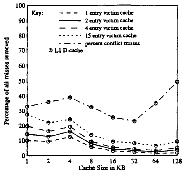

## Summary

빠르게 발전하는 프로세서의 속도를 메모리가 따라잡지 못했습니다. 프로세서의 처리 속도가 아무리 빨라도 메모리가 이 속도를 따라오지 못하면 결국 전체 시스템의 속도는 느려집니다. 이를 개선하기 위해 프로세서와 메모리 사이에 캐시(cache)를 도입했습니다.

캐시는 프로세서와 메모리 사이에서 동작하는 작고 빠른 메모리입니다. 프로세서가 메모리에 있는 데이터를 가져오는데 걸리는 시간을 줄이기 위해서 사용할 정보를 캐시에 미리 저장해놓고 꺼내다 사용합니다.

## Conflict miss

캐시에 필요한 데이터가 없으면 미스(miss)라고 합니다. 이런 경우 다음 캐시나 메모리에 접근해서 데이터를 가져와야합니다. 반면에 필요한 데이터가 있는 경우는 히트(hit)라고 합니다.

미스는 크게 네 가지로 분류하는데 그 중 가장 많이 발생하는 것이 conflict miss입니다. 저장할 데이터들이 캐시의 같은 주소에 할당되어서 생기는 미스입니다.

미스의 증가는 성능에 큰 영향을 주기 때문에 이를 줄이기 위해 여러 방법들이 제시됐습니다.

## Victim cache

그 중 하나가 바로 conflict miss를 개선하기 위한 victim cache입니다. 빅팀 캐시는 direct-mapped cache와 next lower cache 사이에 위치하는 작은 fully-associative cache입니다. direct-mapped cache의 부족한 웨이(way)를 보충해주는 역할을 합니다.

빅팀 캐시의 작동 원리를 케이스 별로 구분하면 다음과 같습니다.

> **Case 1 : Primary cache `hit`**
>
> 정상 작동한다.
>
> **Case 2-1 : Primary cache `miss`, victim cache `miss`**
>
> primary cache의 블록이 비어있는 경우, primary cache에만 저장한다.
>
> **Case 2-2 : Primary cache `miss`, victim cache `miss`**
>
> primary cache의 블록에 데이터가 있는 경우, 데이터를 victim cache로 이동 후 primary cache에 저장한다.
>
> **Case 3 : Primary cache `miss`, victim cache `hit`**
>
> 미스가 발생한 primary cache 블록과 히트가 발생한 victim cache 블록을 스왑(swap)한다.

빅팀 캐시를 통해 conflict miss를 얼마나 개선할 수 있는지는 다음 표에서 확인할 수 있습니다.

## Vary cache size & line size

캐시 크기 별 전체 미스 개선을 나타낸 표 입니다. 라인 사이즈는 16B로 고정하고, 라인 수만 늘려서 프라이머리 캐시 크기를 조절했습니다.

여기서 파악할 수 있는 특징 두 가지가 있습니다. 우선, 라인 사이즈는 고정하고, 캐시 크기만 늘렸기 때문에 상대적으로 작은 빅팀 캐시가 conflict miss를 크게 개선해주지 못합니다. 그리고 발생하는 conflict miss가 줄어들면 빅팀 캐시 개선량도 줄어들고, 반대로 미스가 늘어나면 개선량도 늘어납니다.

라인 사이즈 별 전체 미스 개선을 나타낸 표입니다. 캐시 크기는 4KB로 고정하고, 라인 사이즈만 조절했습니다.

캐시 크기를 고정하고 라인 사이즈만 늘리게 되면 블록 수가 줄어듭니다. 이런 경우 공간적 지역성(spatial locality)이 감소하기 때문에 라인이 일정 이상 커지게 되면 미스가 증가하는 것을 확인할 수 있습니다. 미스가 증가하면 빅팀 캐시의 개선량이 같이 증가합니다.

## Conclusion

위에 두 가지 그래프를 보고 오해하면 안되는 점이 있습니다. 빅팀 캐시의 미스 제거율이 높다고 해서 컴퓨터의 성능이 무조건 좋다고 말할 순 없습니다. 오히려 빅팀 캐시의 역할이 커지는 것은 프라이머리 캐시의 미스가 커진다는 것과 같은 말입니다.

컴퓨터 성능 향상을 위해서는 여러가지 요소들을 종합적으로 바라봐야합니다. 만약에 빅팀 캐시를 구현하려고 한다면 캐시 크기, 라인 사이즈 등의 trade-off를 고려해서 주어진 상황에 맞는 최적의 조건을 찾는 것이 중요합니다.

## Reference

- Norman P. Jouppi, "Improving Direct-Mapped Cache Performance by the Addition of a Small Fully-Associative Cache and Prefetch Buffers", IEEE, 1990.
- David Patterson, John Hennenssy, "Computer Organization and Design : The Hardware and Software Interface 5th Ed", MK, 2014.
