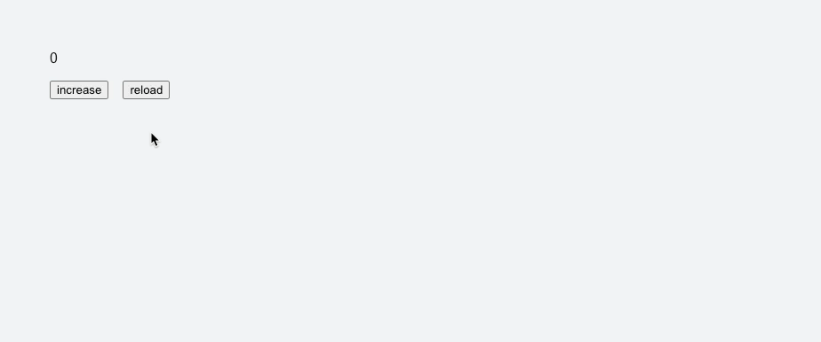

## 개요



Next.js에서 Zustand의 Persist 미들웨어를 사용할 때 발생한 Hydration 에러를 분석한 경험입니다.

이 글에서는 하이드레이션 이슈와 버전업 되면서 해소된 이슈의 원인 그리고 발생한 또 다른 이슈를 정리해 보겠습니다.

## Hydration Mismatch (\<=4.4.7)

Zustand 4.4.7 이하 버전에서는 Persist 미들웨어를 사용하는 경우 페이지 진입 시 Hydration Mismatch 에러를 확인할 수 있습니다.

버그 발생 상황을 구체적으로 구성해 보면 Persist 미들웨어를 사용하는 스토어의 초깃값과 로컬 스토리지(혹은 세션 스토리지)의 값이 달라지는 순간 발생합니다.

```ts store.ts
const store = create()(
  persist(
    (set) => ({
      value: 0,
    }),
    {
      name: 'test-storage',
      storage: createJSONStorage(() => localStorage),
    }
  )
);
```

```
// Local Storage

키           값
test-storage { value: 1 }
```

그렇다면 왜 문제가 발생하는 걸까요?

이 부분을 이해하려면 React의 내장 훅인 useSyncExternalStore과 Zustand Persist 미들웨어가 존재할 때 스토어의 초깃값을 처리하는 방법에 대해 알아야 합니다.

### useSyncExternalStore

[useSyncExternalStore](https://ko.react.dev/reference/react/useSyncExternalStore)는 외부 store를 구독할 수 있는 훅으로 세 가지 인자를 받습니다. 순서대로 `subscribe`, `getSnapshot`, `getServerSnapshot`입니다. 각각 store 구독 함수, 클라이언트 환경의 데이터 스냅샷 반환 함수, 서버 환경의 데이터 스냅샷 반환 함수입니다.

동작을 간단하게 설명하면 훅의 첫 번째 인자에서 callback을 전달해서 store를 구독합니다. 이후 store에서 값이 변경되었을 때 전달받은 callback을 호출(React에 store 변경을 알림) 하면 React는 getSnapshot을 통해 값을 받습니다. 만약 값이 달라진 경우 리렌더링 합니다.

<Callout>

`useSyncExternalStore`는 React 18의 Feature 중 하나인 동시성 렌더링(Concurrent Rendering)에서 발생하는 문제를 해결하기 위해 추가되었습니다.

이와 관련한 내용은 다른 글에서 다뤄보겠습니다.

</Callout>

여기서 자세히 봐야 되는 부분은 세 번째 인자인 `getServerSnapshot`입니다. 이 인자는 공식 문서에 나와있는 것처럼 **서버 렌더링 도중**과 **클라이언트에서 서버 렌더링 된 콘텐츠의 하이드레이션 중**에만 사용됩니다.

여기서 사용된다는 의미는 훅이 해당 값을 반환한다는 의미입니다. 위 내용을 풀어서 얘기해 보면 서버에서는 getServerSnapshot 값이 useSyncExternalStore 훅에서 반환된다고 볼 수 있습니다.

### Zustand Persist Middleware

`Persist`는 어디까지나 Zustand의 미들웨어입니다. 뒤에 자세히 설명하겠지만 앞서 말씀드린 `useSyncExternalStore`의 동작이 일어나기 전에 Persist가 먼저 동작합니다. 이는 구현체를 보면 알 수 있습니다.

```ts src/react.ts
const createImpl = <T>(createState: StateCreator<T, [], []>) => {
  ...생략

  // !mark
  const api = typeof createState === 'function' ? createStore(createState) : createState;

  const useBoundStore: any = (selector?: any, equalityFn?: any) =>
    useStore(api, selector, equalityFn);

  Object.assign(useBoundStore, api);

  return useBoundStore;
};

export const create = (<T>(createState: StateCreator<T, [], []> | undefined) =>
  // !mark
  createState ? createImpl(createState) : createImpl) as Create;
```

`create` 함수에서 `createState` 값이 없으면 `createImpl`을 반환합니다.

그런데 우리가 Zustand Persist를 사용할 때 코드를 자세히 보면 `create()`가 아니라 `create()()`와 같이 사용하고 있습니다.

```ts
const store = create(persist());
// !mark
const store = create()(persist());
```

그렇다면 `createImpl(persist())`을 반환한다고 볼 수 있습니다. `persist()`는 `createImple` 함수 내부에서 `typeof createState === 'function'`에 의해 실행되어 `api`에 할당됩니다.

이 부분을 길게 얘기한 이유는 Persist가 존재하는 경우 클라이언트에서 스토어의 초깃값이 스토리지를 불러온 이후의 값이기 때문입니다. 초깃값의 실체는 `api`에 값이 할당된 이후에 `useStore` 내부에 있는 `useSyncExternalStore`의 반환 값입니다.

```ts src/middleware/persist.ts
// a workaround to solve the issue of not storing rehydrated state in sync storage
// the set(state) value would be later overridden with initial state by create()
// to avoid this, we merge the state from localStorage into the initial state.
```

개발자가 남겨놓은 주석에서 확인할 수 있듯이 Persist 미들웨어에서 반환한 값이 `Rehydration` 시 `create()`에 의해 덮어씌워지는 이슈를 막기 위해 스토리지에서 가져온 값을 초깃값에 병합하는 방식을 선택했습니다.

### 에러의 진짜 원인

먼 길을 돌아 여기까지 왔습니다. 이제 Zustand의 코드를 보고 오류가 발생한 원인을 확인해 보겠습니다.

아래는 Zustand 4.4.7 버전의 코드입니다.

```ts src/react.ts
// v4.4.7
const slice = useSyncExternalStoreWithSelector(
  api.subscribe,
  api.getState,
  // !mark
  api.getServerState || api.getState,
  selector,
  equalityFn
);
```

세 번째 인자로 `api.getState`가 들어가는 걸 확인할 수 있습니다. `api.getState`는 현재 스토어의 저장된 값을 반환하는 메소드입니다. 그런데 클라이언트와 서버 환경에 따라 **값이 달라질 가능성**이 있습니다.

예를 들어서 클라이언트에서는 **스토리지의 값이 스토어의 상태에 병합되어 초깃값**이 됩니다. 반면 서버의 입장에서는 스토리지가 존재하지 않기 때문에 이런 과정 없이 스토어의 초깃값을 갖고 있게 됩니다.

결국 스토어의 초깃값과 스토리지의 값이 달라지는 순간 Hydration Mismatch 오류가 발생합니다.

## Hydration Mismatch 해결 (\>4.4.7)

그렇다면 Zustand는 이 문제를 어떻게 해결했을까요? 의외로 간단합니다.

```ts src/middleware/persist.ts
// !mark
api.getInitialState = () => configResult;
```

```ts src/react.ts
// v4.5.0
const slice = useSyncExternalStoreWithSelector(
  api.subscribe,
  api.getState,
  // !mark
  api.getServerState || api.getInitialState,
  selector,
  equalityFn
);
```

Zustand 4.5.0 버전에서 `api.getInitialState`라는 값을 세 번째 인자로 넘기는 방식으로 이 문제를 해결했습니다. 스토어의 초깃값을 반환하는 `getInitialState`는 하이드레이션 과정에서 클라이언트와 서버를 같은 값으로 동기화합니다.

자세한 이슈 내용은 [이곳](https://github.com/pmndrs/zustand/pull/2277)에 있습니다.

DOM 초기 렌더링 시 `useSyncExternalStore`가 총 네 번 실행된다고 추측해 볼 수 있습니다. 초깃값을 0으로 두고 스토리지에 1을 저장한 상태로 값을 찍어보면서 새로고침하면 다음과 같이 동작합니다.

**\<=4.4.7**

1. 서버 사이드 - 0
2. 클라이언트 사이드 하이드레이션 - 1 -> 리렌더링
   - Hydration Mismatch Error!
3. 클라이언트 사이드 - 1 -> 리렌더링
4. 클라이언트 사이드 - 1 -> `getSnapshot`의 반환 값이 같으므로 리렌더링 X

**\>4.4.7**

1. 서버 사이드 - 0
2. 클라이언트 사이드 하이드레이션 - 0 -> 리렌더링
3. 클라이언트 사이드 - 1 -> 리렌더링
4. 클라이언트 사이드 - 1 -> `getSnapshot`의 반환 값이 같으므로 리렌더링 X

## 또 다른 이슈

Hydration Mismatch 이슈는 버전이 올라가면서 해결되었습니다. 그런데 이번에는 스토어의 초깃값을 바로 이용하는 경우 문제가 발생합니다.

예를 들어서 값이 0인 경우에 메인 페이지로 라우팅하는 로직을 만들었다고 해보겠습니다. 생성 값은 0이고, 스토리지에는 1이 저장되어 있습니다.

```ts
const value = useStore((state) => state.value);

if (value === 0) router.push('/');
```

기존 버전에서는 스토어의 초깃값이 스토리지의 초깃값과 동일했기 때문에 1이 할당되어 의도한 대로 동작합니다.

그러나 이후 버전에서는 초깃값이 생성 값이기 때문에 실제 값인 1이 할당되기 전에 라우팅 되어버립니다. 이 문제를 해결하기 위해선 스토리지 값이 실제로 할당된 이후에 로직을 통과해야 합니다.

Zustand 공식 문서 [How can I check if my store has been hydrated](https://zustand.docs.pmnd.rs/integrations/persisting-store-data#how-can-i-check-if-my-store-has-been-hydrated)에 해결 방법이 나와있습니다.

요지는 Zustand에서 제공하는 `onFinishHydration` 혹은 `hasHydrated` 콜백 함수를 이용하는 것입니다.

## 느낀점

Hydration Mismatch 오류를 해결하기 위해 수정한 두 줄의 코드를 이해하기 위해서 먼 길을 돌아왔다는 생각이 듭니다. 그러나 그 과정에서 리액트를 돌아보고, 자주 사용하는 라이브러리의 코드를 뜯어볼 수 있어서 유익한 시간이었습니다.

내용이 장황하지만 전체적인 내용을 이해하는데 많은 도움이 되었으면 좋겠습니다.
